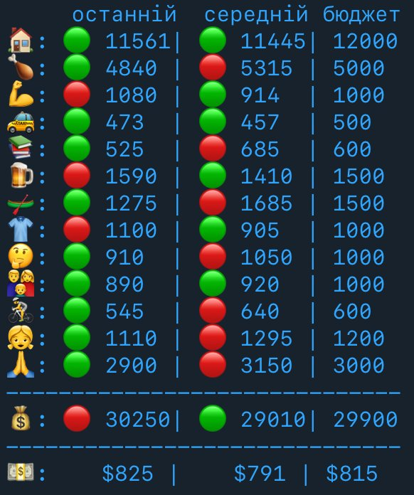

### What is this

This is Telegram Bot that tracks your personal financial budget and sends you regular reports per category like the following:



### Database

The bot requires an SQL database to operate. Create a database using the `transactions.sql` script.
You can use https://www.cockroachlabs.com/ to create free SQL database.
Note down the DbName, DbUser, DbPassword, DbHost and DbPort.


### Custom categories

Create `categories.json` file in the `lambdas` folder (use `categories_example.json` as example).


### Custom rules
Create json files for custom rules using the corresponding examples:
- `lambdas/json/description_to_category.json` - mapping of description to your categories
- `lambdas/json/mcc_translation_to_category.json` - mapping of MCC translations to your categories


### Create TG bot

Create TG bot as described here - https://core.telegram.org/bots/features#botfather
Note down the Bot Api Key.
Also you will need to define you TG chatId. For this you can setup TG webhook to some HTTP server and then text the bot.
Your chatId will be received in the webhook payload.


### Integrate with Mono

Navigate to https://api.monobank.ua/ and note down your API token.
Also you will need to define the accountId to track (for example your Black Card). For this you can use the `/client-info` resource as described here:
https://api.monobank.ua/docs/#tag/Kliyentski-personalni-dani/paths/~1personal~1client-info/get


### Override Parameters

Create `samconfig.toml` with your parameters in the `parameter_overrides` field. Use `samconfig-example.toml` as an example.
You will need an AWS account, and install the AWS SAM CLI
https://docs.aws.amazon.com/serverless-application-model/latest/developerguide/install-sam-cli.html

Update the reporting period in `template.yaml` for the `AllInOneReportFunction`. By default it sends payload everyday at midnight UTC.

After this run the following command to deploy the bot:

`sam build && sam deploy --config-file samconfig.toml`

You will receive the Mono and TG webhook URLs in the output:
```commandline
https://XXXXXXXXXX.execute-api.eu-central-1.amazonaws.com/Prod/mono_webhook 
https://XXXXXXXXXX.execute-api.eu-central-1.amazonaws.com/Prod/telegram_webhook
```


### Configuring webhooks

After deploying the bot and receiving the URLs for Mono and TG, configure the Mono the TG Webhooks:
```commandline
curl --location --request POST 'https://api.telegram.org/botTG_API_TOKEN/setWebhook?url=https%3A%2F%2F2XXXXXXXXXX.execute-api.eu-central-1.amazonaws.com%2FProd%2Ftelegram_webhook'

curl --location 'https://api.monobank.ua/personal/webhook' --header 'X-Token: MONO_API_KEY' --header 'Content-Type: text/plain' --data '{
  "webHookUrl": "https://XXXXXXXXXX.execute-api.eu-central-1.amazonaws.com/Prod/mono_webhook"
}'
```
